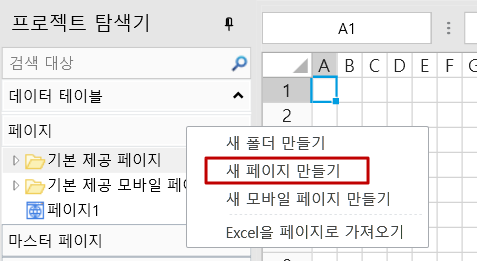
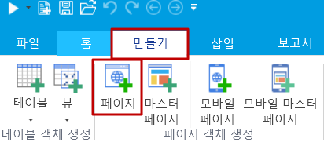
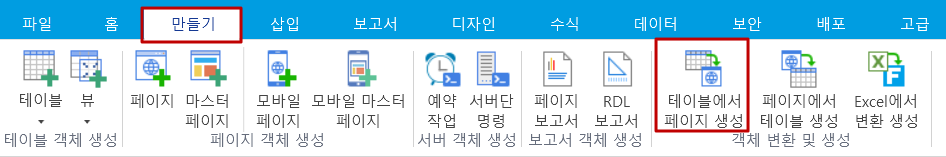
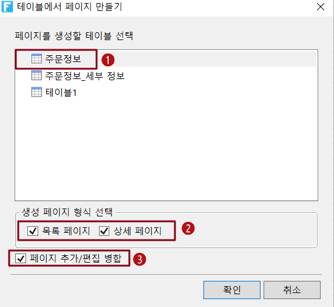

# 일반 페이지

## 일반 페이지 만들기&#x20;

일반 페이지를 만드는 방법에는 여러 가지가 있습니다.

* 방법 1. 개체 관리자의 페이지 탭에서 새 페이지 만들기를 마우스 오른쪽 버튼을 클릭하여 빈 페이지를 만듭니다.           &#x20;

* 방법 2. 리본 메뉴 모음에서 \[만들기]>\[페이지] 선택하여 빈 페이지를 만듭니다.

* 방법 3. Excel 파일에서 페이지를 생성합니다. 리본 메뉴 모음에서 \[데이터]>\[Excel을 페이지로 가져오기] 선택하고 프롬프트에 따라 Excel 파일에서 페이지를 생성합니다.


* Excel 파일에 여러 시트가 있는 경우 하나 이상의 시트를 페이지로 가져오기를 선택할 수 있는 가져오기를 위한 워크시트 선택 상자가 나타납니다.
* Excel 파일에 암호가 포함되어 있으면 암호를 입력하기 전에 암호를 입력해야 합니다.
* Excel에서 다음 설정의 가져오기만 지원됩니다.
  * 라인: 높이
  * 열: 너비
  * 셀: 값, 수식, 숫자 서식, 가로 맞춤, 세로 맞춤, 들여쓰기, 줄 바꿈, 세로 병합, 가로 병합, 하이퍼링크, 배경색, 텍스트 색상, 글꼴, 글꼴 크기, 글꼴 스타일, 밑줄, 가운데 대시, 테두리, 데이터 유효성 검사.
  * Sheet: 그림(.xls 형식 파일의 그림 가져오기는 지원되지 않음), 부분 차트, 인쇄 설정, 이름(테이블 간 참조와 같이 활자 그리드 요구 사항을 충족하지 않는 이름 가져오기는 지원되지 않음). ）


* 방법 4. 데이터 테이블에서 페이지를 생성하고, 즉 데이터 테이블에서 해당 테이블의 데이터 프레젠테이션 및 편집 페이지를 자동으로 생성합니다.                                                                                       아래 절차대로 진행해주세요.

1. 리본 메뉴 모음에서 \[만들기]>\[테이블에서 페이지 생성] 선택합니다.                                                    
2. 팝업 페이지 만들기 창에서 페이지를 생성할 테이블을 선택하고 생성된 페이지 유형과 페이지를 추가/변경할지 여부를 선택합니다.                                                                                                
   * 기본값은 모두 선택된 상태이며 주문정보\_목록 페이지, 주문정보\_상세 페이지가 생성됩니다.\
     목록 페이지는 모든 데이터 테이블의 데이터를 나열하는 테이블입니다. 목록 페이지에는 레코드 추가, 변경 및 삭제에 대한 하이퍼링크가 포함되어 있습니다. 또한 이후 섹션에서 자세히 설명하는 명령도 있습니다.\
     상세 페이지에는 각 데이터의 세부 정보가 표시됩니다.
   * 페이지 추가/편집 병합을 선택 취소하면 목록 페이지, 세부 페이, 페이지 추가 및 페이지 편집 이지가 생성됩니다. 기본 모드를 사용하면 페이지 수를 줄이고 페이지 재사용을 향상시키며 포건시 응용 프로그램 개발에 도움이 될 수 있습니다
3. 페이지가 생성되면 필요에 따라 페이지를 수정할 수 있습니다.

* 방법 5. 포건시 파일을 가져오는 방법입니다. 기존 파일(.fgcc 파일)에서 테이블과 페이지를 가져올 수 있습니다.

1. \[데이터]>\[Forguncy파일 가져오기]를 선택합니다.                           &#x20;
2. 가져올 포건시 파일을 선택하고 \[열기]버튼을 클릭합니다.
3. 가져올 페이지와 테이블을 선택하고 확인을 클릭합니다.

페이지를 가져올 때 페이지에 데이터 테이블에 대한 바인딩 설정이 있지만 테이블을 가져오지 않으면 프로그램 오류가 발생합니다.

