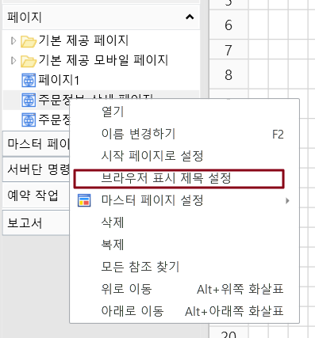
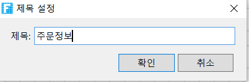
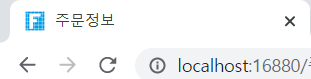
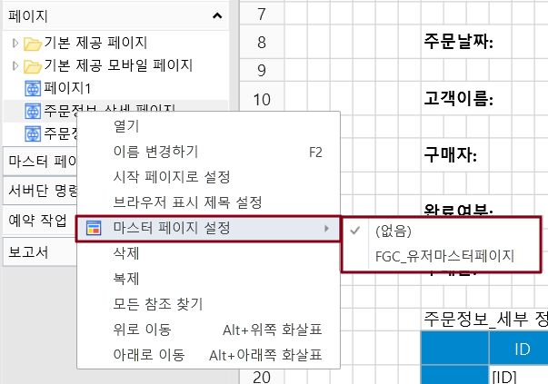
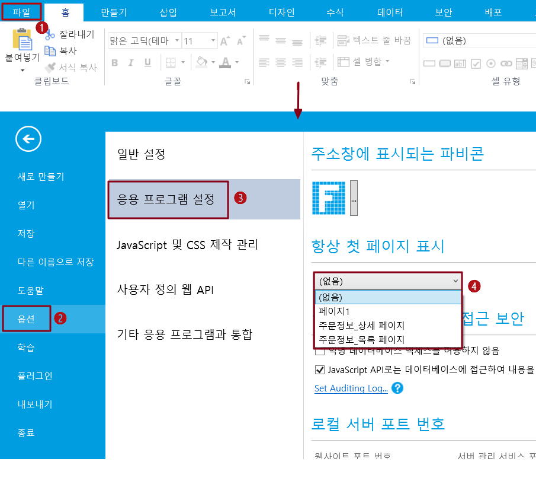
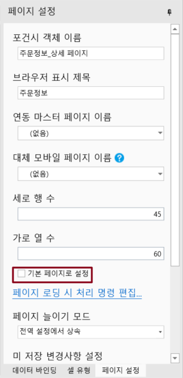

# 일반 페이지 설정

일반 페이지를 만든 후  페이지 설정에서 페이지를 설정할 수 있습니다.

## 포건시 객체 이름&#x20;

페이지의 이름, JavaScript에서 페이지 객체를 가져오는 데 사용할 수 있습니다.

## 브라우저 표시 제목&#x20;

브라우저의 제목 표시줄에 표시되는 이름입니다. 페이지 이름을 마우스 오른쪽 버튼을 클릭하고 브라우저 표시 제목 설정을 선택할 수도 있습니다.

예를 들어 제목을 주문정보로 설정합니다.

프로젝트를 실행 한 후 브라우저의 제목 표시줄이 주문정보로 표시됩니다.

## 연동 마스터 페이지 이름&#x20;

현재 페이지에 이미 있는 마스터 페이지를 설정합니다. 페이지 이름을 마우스 오른쪽 버튼 클릭하고 마스터 페이지 설정을 선택할 수도 있습니다.

마스터 페이지를 선택한 후 오버플로 모드를 설정할 수 있습니다.

## 대체 모바일 페이지 이름&#x20;

현재 페이지의 모바일 페이지를 설정하면 사용자가 모바일을 사용하여 현재 페이지에 액세스할 때 브라우저에 모바일 페이지가 표시됩니다.

브라우저에 동일한 주소를 입력하거나 페이지 이동 명령을 통해 페이지로 이동하려는 경우 컴퓨터 브라우저에 일반 페이지가 표시되고 모바일 브라우저에는 더 작은 크기의 모바일 페이지가 표시됩니다.

일반 페이지와 모바일 페이지를 만들고 일반 페이지 속성 설정 영역의 페이지 설정에서 모바일 페이지를 만든 모바일 페이지로 지정할 수 있습니다. 이렇게 하면 모바일에서 페이지로 이동할 때 실제로 설정된 모바일 페이지가 렌더링됩니다.

## 세로 행 수&#x20;

페이지의 높이를 조정할 수 있는 페이지 행 수를 설정합니다.

## 가로 열 수&#x20;

페이지의 너비를 조정할 수 있는 페이지 열 수를 설정합니다.

## 기본 페이지로 설정&#x20;

페이지를 앱의 시작 페이지로 설정하고 시작 페이지는 웹 사이트의 첫 페이지입니다. 페이지 목록에서 페이지 이름이 굵은 페이지는 첫 페이지입니다.

사이트의 첫 페이지를 설정하는 방법에는 세 가지가 있습니다.

* 방법 1. \[파일]>\[옵션]>\[응용 프로그램 설정]을 선택하고 항상 첫 페이지 표시에서 첫 페이지를 설정한다.

* 방법2. 페이지를 열고 속성 설정 영역의 페이지 설정에서 시작 페이지로 설정을 선택합니다.

* 방법 3. 페이지 마우스 오른쪽 버튼을  클릭하고 팝업 메뉴 선택 상자에서 시작 페이지로 설정을 선택합니다.

## 페이지 로딩 시 처리 명령 편집&#x20;

페이지가 로드될 때 실행되는 특정 명령입니다.

## 페이지 늘이기 모드

전역 설정에서 상속, 없음, 수평으로 늘이기, 세로 늘이기, 양쪽 늘이기, 화면 비율 유지하고 수평으로 늘이기 등 의6가지 모드를 상속하도록 선택하여 페이지의 늘이기 모드를 설정할 수 있습니다.

## 미 저장 변경사항 설정&#x20;

페이지를 떠날 때 제출된 데이터가 있는지 확인하고, 체크한 후 확인하고, 페이지에 제출되지 않은 데이터가 있는 경우 페이지를 나갈 때 프롬프트 상자가 나타납니다. 기본적으로 이 항목은 선택 취소되어 있습니다.

## 사용자 JavaScript 업로드&#x20;

페이지에 첨부된 특정 JavaScript(접미사 이름.js) 파일입니다.

## 탭 키 이동 순서&#x20;

페이지에서 커서 컨트롤이 이동하는 순서를 설정합니다.


기본적으로 커서는 왼쪽에서 오른쪽으로, 위에서 아래로 이동합니다. 탭 순서를 설정하여 텍스트 상자 또는 다중 상자와 같은 여러 입력 상자에서 커서가 이동하는 순서를 변경할 수 있습니다.

* **: 선택한 객체를 맨 앞에 놓습니다.**
* **: 선택한 객체를 한 위치 앞으로 이동합니다.**
* **: 선택한 객체를 한 위치 뒤로 이동합니다.**
* **: 선택한 객체를 맨 위에 놓습니다.**


