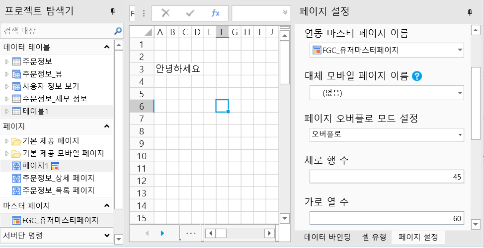

# 오버플로 모드

마스터 페이지를 선택한 후 오버플로 모드를 설정하여 하위 페이지를 표시하는 방법을 설정할 수 있습니다. 세 가지 모드가 있습니다.

* 오버플로: 페이지 자리 표시자가 하위 페이지를 완전히 표시할 수 있을 때까지 확장됩니다.
* 스크롤: 스크롤 막대가 나타납니다.
* 잘라내기: 마스터 페이지 페이지 자리 표시자를 초과하는 하위 페이지의 일부가 잘려 표시되지 않습니다.

오버플로 모드마다 페이지가 다르게 표시됩니다. 예를 들어 새 마스터 페이지 1, 세로 행 수 45, 가로 열 수  60개, 는 다음 그림과 같습니다.

다음은 서로 다른 오버플로 모드에서 페이지가 어떻게 표시되는지 각각 설명합니다.

## 오버플로

페이지 1에서 행 수 10개, 열 수 20개, 마스터 페이지 1, 페이지 오버플로 모드설정에 오버플로를 설정합니다.

영역을 선택하고 문자와 스타일을 설정합니다.

.png>)

다음 그림과 같이 페이지 자리 표시자를 벗어난 부분을 포함하여 실행 후 텍스트가 모두 표시됩니다.

.png>)

## 스크롤

페이지 1에서 행 수는 10개, 열 수는 20개, 마스터 페이지는 마스터 페이지 1, 오버플로 모드는 스크롤로 설정됩니다.

영역을 선택하고 문자와 스타일을 설정합니다.

.png>)

실행 후 페이지 아래에 스크롤 막대가 표시되고 페이지 자리 표시 영역을 벗어난 텍스트는 스크롤 막대를 이동하여 완전히 표시해야 합니다.

.png>)

## 잘라내기&#x20;

페이지 1에서 행 수 10개, 열 수 20개, 마스터 페이지 1, 오버플로 모드 클리핑을 설정합니다.

영역을 선택하고 문자와 스타일을 설정합니다.

.png>)

실행 후 페이지의 자리 표시자를 벗어난 페이지의 텍스트가 잘려 표시되지 않습니다.

.png>)
