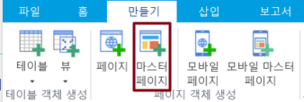
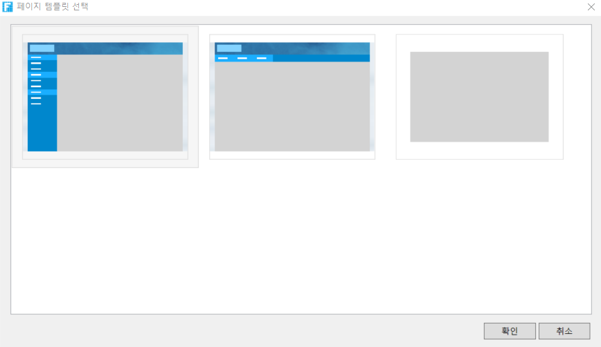
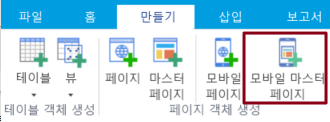
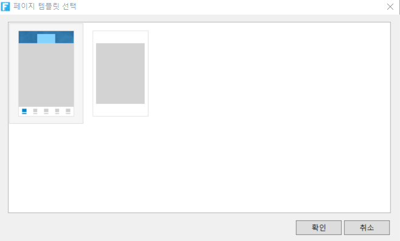
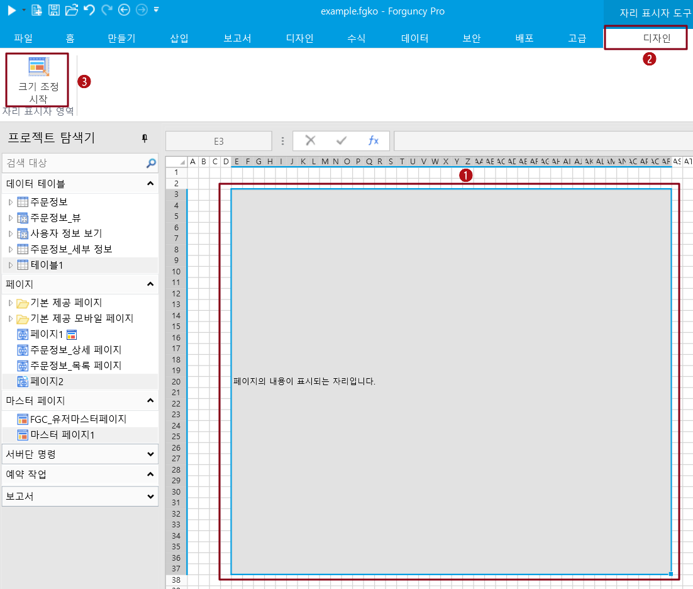
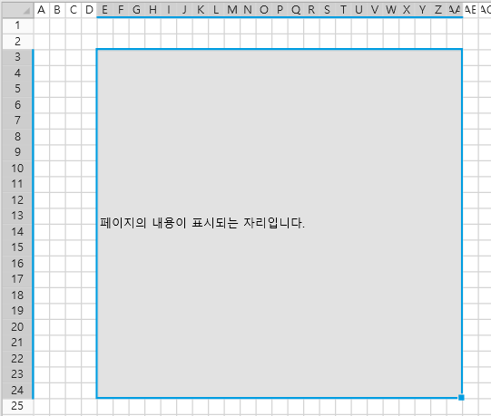
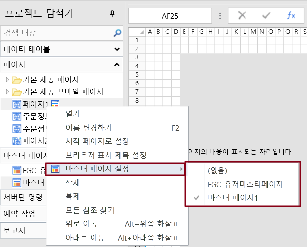
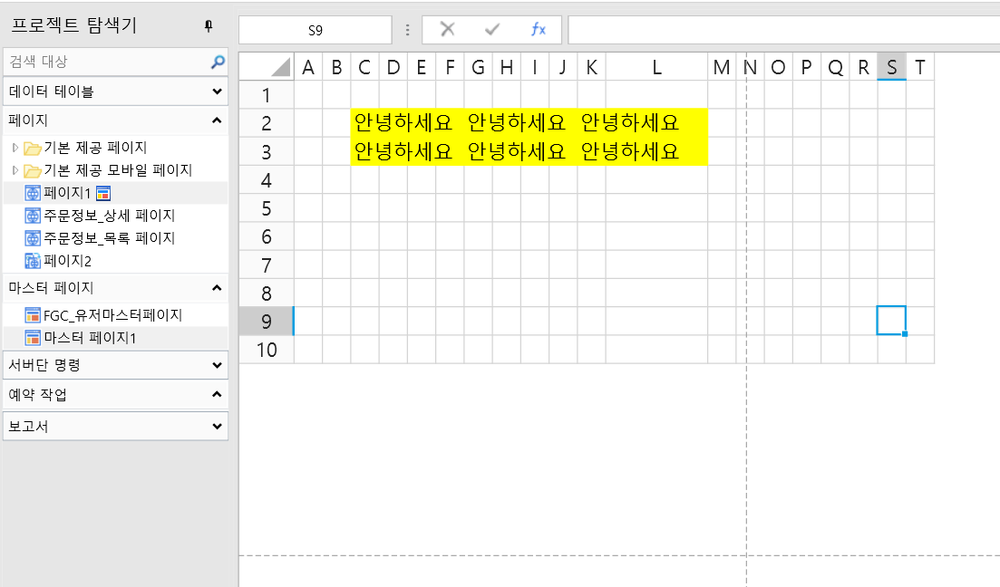

# 마스터 페이지 만들기

마스터 페이지는 여러 일반 페이지(예: 마스터 페이지에서 탐색 모음 디자인)와 함께 사용할 수 있는 공유 섹션을 디자인하는 데 사용됩니다. 마스터 페이지를 사용하여 응용 프로그램의 모양을 통합합니다.

마스터 페이지는 모바 마스터 페이지와 일반 마스터 페이지의 두 가지 유형으로 나뉩니다. 일반 페이지는 일반 마스터 페이지만 적용할 수 있으며 모바일 페이지는 모바일 마스터 페이지만 적용할 수 있습니다.

페이지가 마스터 페이지를 사용하는 경우 마스터 페이지의 하위 페이지가 되고 마스터 페이지의 페이지 자리 표시자 영역에 나타납니다.

## **일반 마스터 페이지 만들기** 

일반 마스터 페이지를 만드는 방법은 두가지가 있습니다.

* 방법 1. 리본 메뉴 모음에서 \[만들기]>\[마스터페이지]를 선택합니다.

*   방법 2. 마스터 페이지 탭에서 \[새 페이지 만들기]를 마우스 오른쪽 버튼 클릭합니다.                        "페이지의 템플릿 선택" 대화 상자가 나타나면 마스터 페이지의 템플릿을 선택하고 템플릿 1의 템플릿에는 위쪽 및 세로 방향의 메뉴가 설정되고 템플릿 2의 템플릿에는 위쪽 및 가로 방향 메뉴가 설정되고 템플릿 3은 빈 템플릿이 있습니다.

    템플릿 1과 템플릿 2는 테마에 따라 다릅니다. 템플릿을 선택한 후 확인을 클릭하여 일반 마스터 페이지를 만듭니다.

## 모바일 마스터 페이지 만들기

모바일 마스터 페이지를 만드는 방법에는 두 가지가 있습니다.

* 방법 1. 리본 메뉴 모음에서 \[만들기]>\[모바일 마스터 페이지] 택합니다.

*   방법 2. 프로젝트 탐색기의 마스터 페이지 탭에서 마우스 오른쪽 버튼을 클릭하여  새 모바일 페이지 만들기를 클릭합니다. \[페이지 템플릿 선택] 대화 상자가 나타나면 마스터 페이지의 템플릿을 선택하고 템플릿 1의 템플릿에는 맨 위 막대와 아래쪽 메뉴가 설정되고 템플릿 2는 빈 템플릿입니다.

    템플릿 1은 테마에 따라 다릅니다. 템플릿을 선택한 후 확인을 클릭하여 모바일 마스터 페이지를 만듭니다.

## **페이지 자리 위치 크기를 조정** 

마스터 페이지는 일반 셀 범위와 페이지 자리 매김의 두 부분으로 나뉩니다. 일반 셀 범위에서 탐색 모음과 같은 공유 섹션을 디자인할 수 있으며 페이지 자리 표시자는 일반 페이지 표시를 전환하는 데 사용됩니다.

페이지 자리 표시자 크기를 조정하여 일반 페이지를 표시할 수 있습니다.

아래 절차대로 진행합니다.

1. 마스터 페이지를 열고 페이지 자리 표시를 선택한 다음 기능 메뉴 모음에서 \[디자인]>\[크기 조정 시작]을 선택합니다.                                                                             &#x20;

2. \[크기 조정 시]을 클릭하면 페이지 자리 표시 공간이 파란색 테두리로 둘러싸여 파란색 테두리의 네 모서리를 드래그하여 크기와 위치를 조정합니다.                                                         &#x20;

3. \[크기 조정 종료]를 클릭하여 조정을 종료합니다.

## &#x20;**마스터 페이지를 적용** 

일반 페이지 또는 모바일 페이지에 마스터 페이지를 적용하여 응용 프로그램의 모양을 통합합니다.

페이지를 선택하고 마스터 페이지 설정을 마우스 오른쪽 버튼을 클릭하고 팝업 마스터 페이지 목록에서 마스터 페이지를 선택하여 적용합니다.

일반 페이지는 일반 마스터 페이지만 적용할 수 있으며 모바일  페이지는 모바일 마스터 페이지만 적용할 수 있습니다.

개체 관리자에서 마스터 페이지가 설정된 페이지의 오른쪽에 아이콘이 나타납니다.

페이지가 마스터 페이지를 설정하면 마스터 페이지 자리 표시자의 길이와 너비 경계를 나타내는 두 개의 점선이 페이지에 표시됩니다.&#x20;

