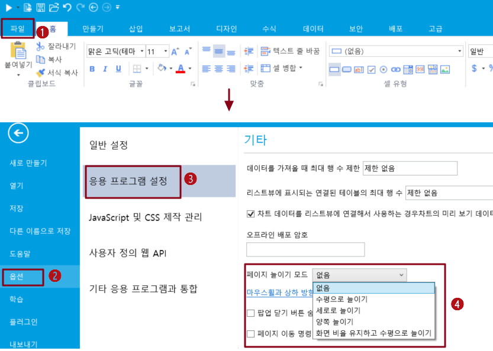
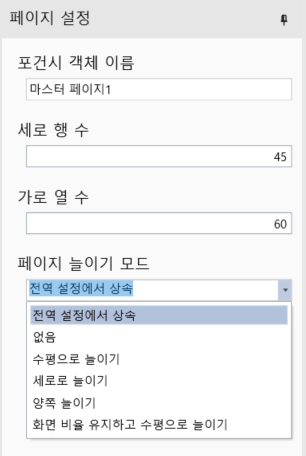

# 페이지 늘이기 모드

사용자는 일반적으로 브라우저 창과 크기가 같지 않은 다양한 크기의 화면을 통해 웹 사이트를 방문하므로 사용자는 방문할 때 웹 사이트 페이지에 맞게 브라우저 창의 크기를 조정합니다.

포건는 브라우저 창 크기를 조정할 때 웹 사이트 페이지 표시에 맞게 선택할 수 있는 다양한 페이지 늘이기 모드를 제공합니다.

전역 또는 개별 페이지에 대한 페이지 늘이기 모드를 설정할 수 있습니다.

## 전역 설정

포건시 파일의 모든 페이지에 적용되는 전역 설정입니다.

\[파일]>\[옵션]>\[응용 프로그램 설정]>\[페이지 늘이기 모드]를 설정합니다.

페이지 늘이기는 아래와 같이 다섯 가지 모드가 있습니다.

* 없음: 페이지는 디자이너에서와 일치하도록 브라우저에서 늘어나지 않습니다.
* 수평으로 늘이기: 브라우저 크기와 함께 다른 브라우저에서 페이지가 가로로 늘어납니다.
* 세로로 늘이기: 브라우저 크기와 함께 다른 브라우저에서 페이지가 세로로 늘어납니다.
* 양쪽 늘이기: 브라우저 크기와 함께 다른 브라우저에서 페이지를 가로 및 세로로 늘이면 다양한 해상도의 브라우저에서 더 나은 시각적 효과를 얻을 수 있습니다.
* 화면 비율 유지하고 수평으로 늘이기 : 페이지가 브라우저의 너비를 채우고 높이를 등가로 니다.

## 단일 페이지 설정&#x20;

페이지의 페이지 설정에서 페이지의 늘이기 모드를 설정할 수 있습니다. 여기에는 전역 설정에서 상속, 없음, 수평으로 늘이기, 세로로 늘이기, 양쪽 늘이기, 화면 비율 유지하고 수평으로 늘이기  6가지 모드 포함됩니다.

여기서 전역 설정에서 상속된 이 페이지의 늘이기 모드는 \[파일]>\[옵션]>\[응용 프로그램 설정]>\[페이지 늘이기 모드] 설정과 동일합니다.

## 페이지 스트레치 모드

페이지 늘이기 모드는 없음, 수평으로 늘이기, 세로로 늘이기, 양쪽 늘이기, 화면 비율 유지하고 수평으로 늘이기 다섯 가지 유형으로 제공됩니다.

### 없음

페이지는 디자이너에서와 마찬가지로 브라우저에서 늘어나지 않습니다.

### 수평으로 늘이기

페이지는 브라우저 크기와 함께 다른 브라우저에서 가로로 늘어납니다.

### 세로 늘이기

페이지는 브라우저 크기에 따라 다른 브라우저에서 세로로 늘어납니다.

### 양쪽 늘이기&#x20;

브라우저 크기에 따라 페이지를 가로 및 세로로 늘이면 다양한 해상도의 브라우저에서 더 나은 시각적 효과를 얻을 수 있습니다.

### 화면 비율 유지하고 수평으로 늘이기

페이지는 브라우저의 너비를 채우고 높이를 등가로 늘립니다.
