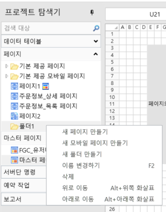
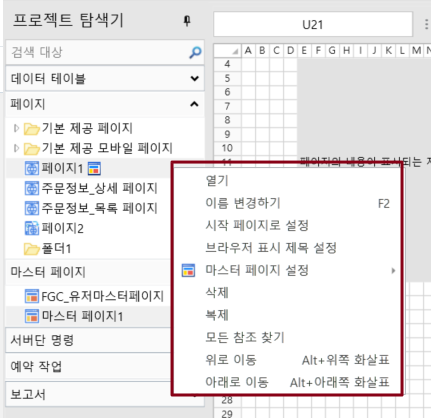

# 페이지 작업

페이지에 대한 일반적인 작업에 대해 설명합니다.

## 기본 작업&#x20;

### 폴더 만들기

페이지 탭을 마우스 오른쪽 버튼 클릭하고 폴더 만들기를 선택합니다. 페이지를 폴더 밖으로 드래그/제거할 수 있습니다.

### 폴더 작업

폴더를 선택하고 마우스 오른쪽 버튼 클릭하면 팝업 메뉴 모음에서 새 페이지 만들기, 새 모바일 페이지 만들기, 새 폴더 만들기, 이름 변경하기, 삭제, 위로 이동, 아래로 이동 선택할 수 있습니다.

### 페이지 작업&#x20;

페이지를 선택하고 마우스 오른쪽 버튼 클릭하면 팝업 메뉴 모음에서 열기, 이름 변경하기, 시작 페이지로 설정, 브라우저 표시 제목 설정, 마스터 페이지 설정, 삭제, 복제, 모든 참조 찾기, 위로 이동, 아래로 이동을 선택할 수 있습니다.

## **페이지 크기 조정** 

작업공간에서 전체 행 또는 열을 선택하고 행 또는 열의 마우스 오른쪽 버튼 클릭 메뉴에서 삽입, 삭제, 행 높이 또는 열 너비 등을 선택하여 페이지 크기를 변경합니다.

* 삽입: 행이나 열을 선택하기 전에 새 행이나 열을 삽입합니다. 삽입된 행과 행의 수는 선택한 행과 행의 수와 동일합니다.
* 삭제: 선택한 행 또는 열을 삭제합니다.
* 행 높이/열 너비: 행 높이 또는 열 너비를 픽셀 단위로 설정합니다. 기본값은 20픽셀입니다.

행과 열에 대해 다음을 수행할 수도 있습니다.

### 행과 열을 분할

페이지의 작업 영역에서 행의 행 헤 또는 열의 열 헤더를 마우스 오른쪽 버튼을 클릭하고 메뉴에서 두 행으로 분할 또는 두 개의 열로 분할을 클릭하면 선택한 행/열이 두 행/열로 분할됩니다. 분할 후 두 행/열의 높이/폭의 합계는 이전 행/열의 높이/폭과 일치합니다.

### 레이아웃을 변경하지 않고, 행의 높이/열 너비를 변경&#x20;

페이지의 작업 영역에서 Ctrl 키를 누른 채 행과 열을 드래그하여 행 높이와 열 너비를 변경합니다. 이렇게 하면 행의 높이/열 너비를 변경한 후에도 레이아웃을 그대로 유지할 수 있습니다.

<figure><figcaption>
열 너비를 변경하기 전 
</figcaption></figure>

<figure><figcaption>
열 너비 변경 후 
</figcaption></figure>

### 행과 열을 숨기거나 표시

#### 숨기기&#x20;

브라우저에 행이나 열을 표시하지 않으려면 행/열의 높이/너비를 0으로 조정하거나 행/열을 숨기도록 설정할 수 있습니다.

디자이너에서 행 또는 열이 숨겨지면 행/열 헤더가 회색으로 표시됩니다. 브라우저에서 숨겨진 행과 열은 표시되지 않습니다.

페이지의 작업 영역에서 숨길 행이나 열을 선택하고 행 중 하나의 행 머리글 또는 열 헤더를 마우스 오른쪽  버튼을 클릭하고 \[숨기기]를 클릭합니다.

.png>)

#### 숨기기 취소

행 또는 열의 숨기기를 해제하려면 행 또는 열의 숨기기를 다시 표시할 수 있습니다.

페이지의 작업 영역에서 표시할 행이나 열을 선택하고 행 중 하나 또는 열의 열 헤더를 마우스 오른쪽 버튼 클릭한 다음 \[숨기기 취소]를 클릭합니다.

.png>)

## 단축 키 목록 

단축키를 사용하면 포건시에서 보다 효율적으로 작업할 수 있습니다. 포건시 단축키는 Microsoft Excel과 일치합니다.

| 단축키                               | 설명                                                                    |
| --------------------------------- | --------------------------------------------------------------------- |
| Ctrl + A 또는 Ctrl + Shift + 스페이스 바 | 작업 영역의 모든 셀을 선택합니다.                                                   |
| Ctrl + B 또는 Ctrl + 2              | 셀 적용을 선택하거나 굵게 서식을 해제합니다.                                             |
| Ctrl + C                          | 선택한 셀을 클립보드로 복사합니다.                                                   |
| Ctrl + I 또는 Ctrl + 3              | 셀 적용을 선택하거나 기울임꼴 서식을 해제합니다.                                           |
| Ctrl + M                          | 셀 범위를 선택 하고 셀 병합을 취소 합니다.                                             |
| Ctrl + S                          | 파일을 저장합니다.                                                            |
| Ctrl + U 또는 Ctrl + 4              | 셀 적용을 선택하거나 밑줄을 긋습니다.                                                 |
| Ctrl + V                          | 클립보드의 내용을 선택한 셀에 붙여 넣습니다. 콘텐츠를 복사하거나 잘라낸 경우에만 사용할 수 있습니다.             |
| Ctrl + W 또는 Ctrl + F4             | 열려 있는 페이지 또는 테이블을 닫습니다.                                               |
| Ctrl + X                          | 선택한 셀을 잘라냅니다.                                                         |
| Ctrl + Y                          | 이전에 취소된 명령, 동작 또는 텍스트 내용을 반복합니다.                                      |
| Ctrl + Z                          | 이전 명령, 동작 또는 텍스트 내용을 취소합니다.                                           |
| Ctrl + 1                          | \[셀 서식 지정] 대화 상자를 표시합니다.                                              |
| Ctrl + 5                          | 선택한 셀이 선을 적용하거나 취소합니다.                                                |
| Ctrl + F1                         | 리본을 표시하거나 숨깁니다.                                                       |
| F2                                | 선택한 셀이 편집 상태로 들어갑니다.                                                  |
| Alt + F4                          | 활자 격자를 종료합니다.                                                         |
| F5                                | 응용 프로그램을 실행합니다.                                                       |
| F10                               | 바로 가기 키에 대한 프롬프트를 켜거나 끕니다.                                            |
| F12                               | \[다른 이름으로 저장] 대화 상자를 표시합니다.                                           |
| 화살표 키입니다                          | 작업 영역에서 선택한 셀의 위쪽, 아래쪽, 왼쪽 및 오른쪽 방향의 셀로 이동합니다.                        |
| Ctrl + 화살표 키입니다                   | 작업 영역에서 선택한 셀의 맨 위, 맨 아래, 맨 왼쪽 또는 맨 오른쪽 셀로 이동합니다.                     |
| Shift+화살표 키입니다                    | 현재 선택한 셀 범위에 대해 위쪽, 아래쪽, 왼쪽 및 오른쪽으로 확장합니다.                            |
| Backspace                         | 셀 또는 수식 막대에 입력할 때 커서 왼쪽에 있는 문자를 제거합니다. 셀 또는 수식 표시줄에서 선택한 문자를 지웁니다.    |
| Delete                            | 셀 또는 수식 표시줄에 입력할 때 커서 오른쪽에 있는 문자를 제거합니다. 셀 또는 수식 표시줄에서 선택한 문자를 지웁니다.  |
| End                               | 작업 영역의 현재 셀이 있는 행의 맨 오른쪽에 있는 셀로 이동합니다.                                |
| Ctrl + End                        | 작업 영역의 오른쪽 아래 모서리에 있는 셀로 이동합니다.                                       |
| Home                              | 작업 영역의 현재 셀이 있는 행의 맨 왼쪽 셀로 이동합니다.                                     |
| Ctrl + Home                       | 작업 영역의 왼쪽 위 모서리에 있는 셀로 이동합니다.                                         |
| Enter                             | 셀 또는 수식에 대한 입력을 완료하고 아래 셀을 선택합니다. 셀에서 기본 단추(예: 확인, 열기)에 대한 명령을 실행합니다. |
| Alt + Enter                       | 줄 바꿈.                                                                 |
| Shift + Enter                     | 셀 또는 수식에 대한 입력을 완료하고 위의 셀을 선택합니다.                                     |
| Esc                               | 셀 또는 수식 표시줄의 입력을 취소합니다. 열려 있는 메뉴, 하위 메뉴, 대화 상자 또는 메시지 창을 닫습니다.        |
| Page Down                         | 작업 영역의 맨 아래로 이동합니다.                                                   |
| Ctrl + Page Down                  | 작업 영역의 다음 페이지 또는 테이블로 이동합니다.                                          |
| Page Up                           | 작업 영역의 맨 위로 이동합니다.                                                    |
| Ctrl + Page Up                    | 작업 영역의 이전 페이지 또는 테이블로 이동합니다.                                          |
| 스페이스바입니다                          | 대화 상자에서 단추를 선택하는 명령을 실행하고 확인란의 선택을 선택 취소하거나 선택 취소합니다.                 |
| Ctrl + 스페이스바                      | 작업 영역을 선택하여 셀 범위가 있는 전체 열을 선택합니다. 영어 입력 모드만 지원됩니다.                    |
| Shift+스페이스바                       | 작업 영역을 선택하여 셀 범위가 있는 전체 행을 선택합니다. 영어 입력 모드만 지원됩니다.                    |
| Alt + 스페이스바                       | 컨트롤 메뉴를 표시합니다.                                                        |
| Tab                               | 작업 영역에서 선택한 셀의 다음 셀로 이동합니다. 대화 상자에 있는 경우 다음 옵션 또는 옵션 그룹으로 이동합니다.      |
| Shift + Tab                       | 작업 영역에서 선택한 셀의 이전 셀로 이동합니다. 대화 상자에 있는 경우 이전 옵션 또는 옵션 그룹으로 이동합니다.      |
| Ctrl + Tab                        | 대화 상자에서 다음 옵션 영역으로 전환합니다.                                             |
| Ctrl + Shift + Tab                | 대화 상자에서 이전 옵션 영역으로 전환합니다.                                             |
