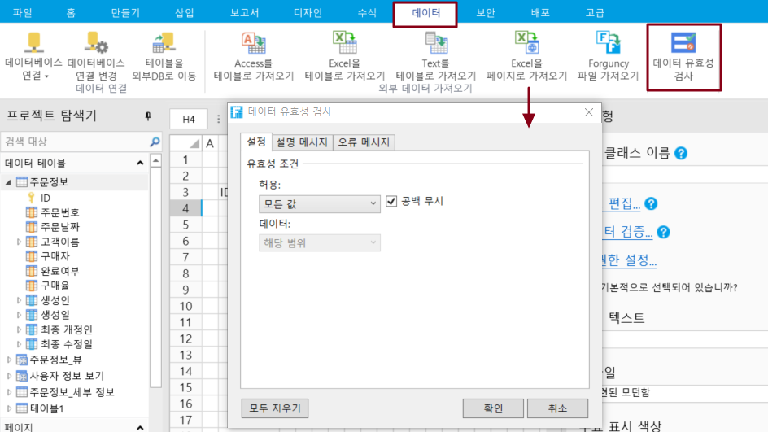
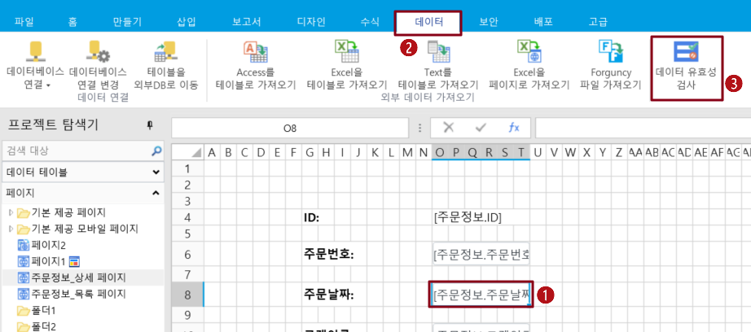
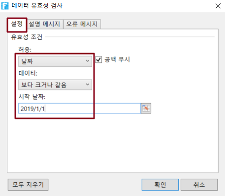
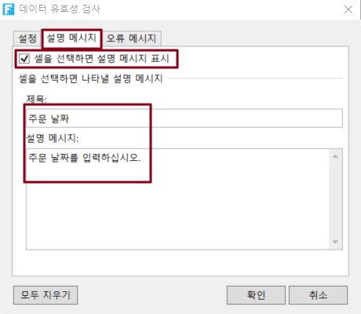
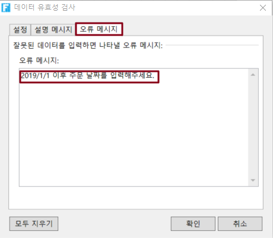
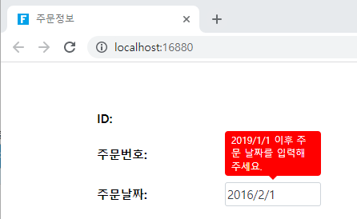

# 페이지 측 검사

포건시에서 셀 또는 셀 범위에 대한 데이터 검사를 설정할 수 있습니다(예: 셀이 값을 입력해야 하거나 문자 길이를 제한해야 하는 경우 제한)

## 페이지 측 검사

페이지에서 셀 또는 셀 범위를 선택하고 리본 메뉴 모음에서 데이터를 선택한 다음 데이터 유효성 검사를 클릭합니다. 데이터 유효성 검사 설정에 대한 설명은 아래 표에 나와 있습니다.

| 항목      | 설명                                                                                                                                                                                                                                                                                 |
| ------- | ---------------------------------------------------------------------------------------------------------------------------------------------------------------------------------------------------------------------------------------------------------------------------------- |
| 설정      | 
데이터의 유효성 검사 조건 설정: 허용되는 숫자 유형 및 데이터입니다.

"공백 무시"를 선택하면 아무 것도 입력할 수 없습니다. 이 옵션을 선택하지 않으면 필수이며 비어 있을 수 없습니다.

허용되는 데이터 유형에는 정수, 소수점, 날짜, 시간, 텍스트 길이, 사용자 지정, 정규식이 포함됩니다.

정규식의 기본 제공 유형에는 이메일 주소, IP 주소, URL, 유선 전화 번호, 휴대폰 번호, 우편 번호, 개인 ID 번호, 신용 카드가 포함됩니다.
 |
| 설명 메시지  | 
셀을 선택할 때 입력한 정보를 표시합니다. 제목 및 정보 콘텐츠를 설정할 수 있습니다.

입력 메시지는 일반적으로 사용자가 셀에 입력해야 하는 데이터 유형을 안내하는 데 사용됩니다. 이러한 메시지는 셀 근처에 표시됩니다.
                                                                                                                                            |
| 오류 메시지  | 잘못된 데이터를 입력할 때 표시되는 오류 메시지입니다.                                                                                                                                                                                                                                                     |


* 데이터 유효성 검사 설정은 입력할 수 있는 형식의 셀 유형에 대해서만 작동합니다. 셀 유형이 비어 있거나 그림과 같은 입력되지 않은 형식 셀이 작동하지 않습니다.
* 포건시의 데이터 유효성 검사는 Excel의 데이터 유효성 검사와 유사합니다. 차이점은 두 가지입니다.
  * 포건시는 정규식 조건을 지원합니다. Excel은 정규식을 지원하지 않으므로 Excel을 내보낼 때 정규식 설정이 손실됩니다.
  * 포건시는 "시퀀스" 조건을 지원하지 않습니다. 콤보 상자 셀 형식을 사용하여 구현할 수 있습니다.


예를 들어 주문 추가 페이지에서 주문 날짜에 대한 데이터 유효성 검사를 수행하려면 2019년 1월 1일보다 큰 주문 날짜를 입력해야 합니다. 이 작업을 수행하는 방법은 다음과 같습니다.

\
1\.  주문 날짜 셀을 선택하고 데이터 유효성 검사를 클릭합니다.

2. 다음 그림과 같이 데이터 유효성 검사 대화 상자에서 설정을 선택하고, 날짜를 선택하고, 데이터 선택을 더 크거나 같으며, 시작 날짜는 다음 그림과 같이 2019/1/1입니다.

3. \[설명 메시지]를 선택하여 셀을 선택할 때 표시되는 입력 정보를 설정합니다. 셀을 선택할 때 입력 정보 표시를 선택하지 않으면 입력 정보가 표시되지 않습니다.\
   다음 그림과 같이 "주문 날짜"라는 제목을 설정하고 "주문 날짜를 입력하십시오"라는 정보를 입력합니다.

4. 잘못된 데이터를 입력할 때 표시되는 오류 경고를 설정하려면 오류 경고를 선택합니다.

5. 실행 후 주문을 추가하면 주문 날짜 셀에서 날짜를 선택할 때 설정된 입력 정보가 표시됩니다. 2019/1/1보다 작은 날짜를 선택한 후 다음 정보를 입력하면 오류 경고가 빨간색으로 표시됩니다.

