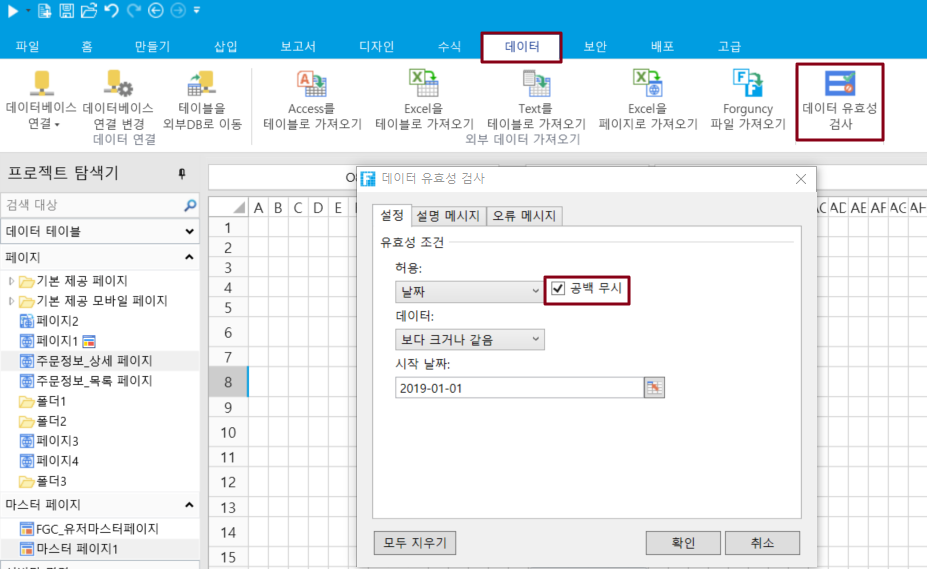

# 데이터 유효성 검사

웹 페이지에서 양식을 제출할 때 양식의 필수 항목의 유효성을 검사해야 하는 경우가 많습니다. 포건시에서 데이터 유효성 검사를 설정하여 양식의 필수 항목을 확인할 수 있습니다.

## **데이터 유효성 설정** 

페이지에서 셀 또는 셀을 선택합니&#xB2E4;**.** 리본 메뉴 모음에서 데이터를 선택하고 데이터 유효성 검사를 클릭합니다.

데이터 유효성 검사 대화 상자의 설정에서 공백무시 선택이 기본으로 되어있습니다.&#x20;

