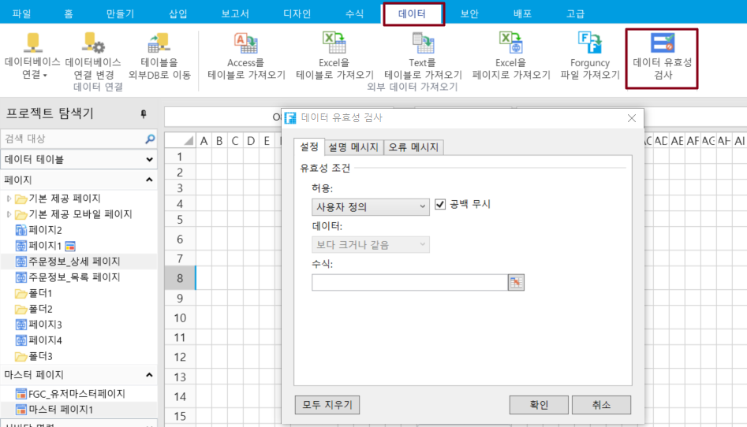

# 수식 검사

포건시의 데이터 유효성 검사에서 사용자 지정 유효성 검사는 수식 검사를 사용하여 데이터 입력을 표준화합니다.

페이지에서 셀 또는 셀을 선택합니다. 리본 메뉴 모음에서 데이터를 선택하고 데이터 유효성 검사를 클릭합니다.

데이터 유효성 검사 대화 상자의 설정에서 유효성 검사 조건의 \[사용자 정의]을 선택할 수 있는 경우 수식 유효성 검사를 위해 수식을 설정하고 데이터 입력을 표준화할 수 있습니다.

