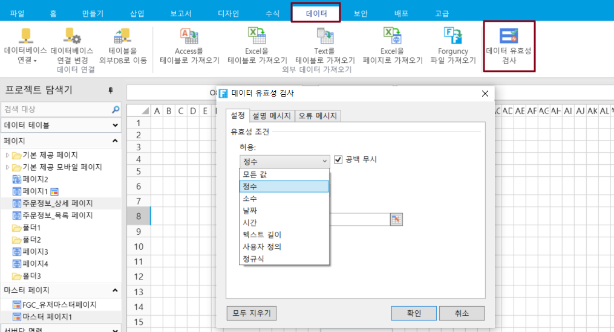

# 수치 검사

포건시에서 데이터 유효성 검사를 사용하여 정수, 소수, 날짜 및 텍스트 길이에 대한 숫자 확인과 같은 데이터 형식 또는 사용자가 입력한 셀의 값을 제한할 수 있습니다.

페이지에서 셀 또는 셀을 선택합니다. 리본 메뉴 모음에서 데이터를 선택하고 데이터 유효성 검사를 클릭합니다.

데이터 유효성 검사 대화 상자의 \[설정]에서 유효성 검사 조건의 \[허용] 목록에서 정수, 소수, 날짜 또는 텍스트 길이를 선택할 때 지정된 범위를 벗어난 숫자를 입력할 수 없도록 숫자 범위를 설정할 수 있습니다.

