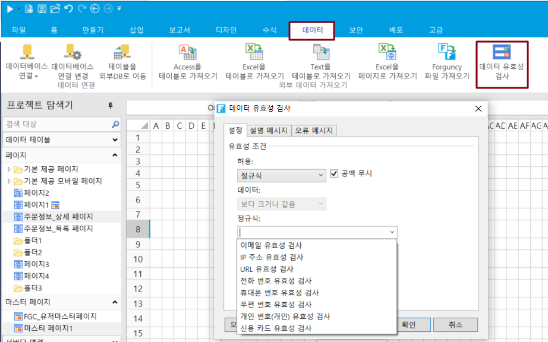

# 정규식

정규식은 문자열 및 특수 문자 작업에 대한 논리적 수식으로, 미리 정의된 특정 문자와 해당 문자의 조합을 사용하여 문자열에 대한 필터링 논리를 표현하는 데 사용되는 "규칙 문자열"을 형성합니다.

라이브 그리드의 데이터 유효성 검사에서 정규식 검사가 지원됩니다. 정규식을 사용하여 이메일, IP 주소, URL, 전화 번호, 휴대폰 번호, 우편 번호, 개인 번호, 신용 카드를 포함한 데이터 유형을 확인하는 데이터의 유효성을 검사합니다.

