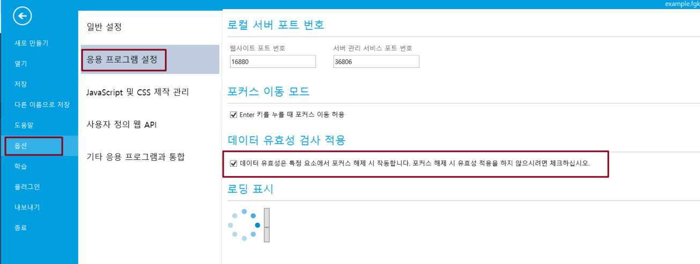

# 데이터 유효성 검사 트리거

셀이 데이터 유효성 검사를 설정한 후 데이터 유효성 검사를 트리거할 시간이 필요합니다.

셀에 데이터 유효성 검사가 설정된 경우 브라우저에서 다음과 같은 경우 데이터 유효성 검사가 트리거됩니다.

*   리스트뷰의 셀

    데이터가 제출될 때 데이터 유효성 검사를 트리거합니다.
*   리스트뷰가 없는 셀

    기본값은 포커스가 손실될 때 유효성 검사를 트리거하는 것입니다.

    데이터 유효성 검사가 트리거되는 시기를 변경할 수도 있습니다. \[파일]>\[옵션]>\[응용 프로그램 설정]> \[데이터 유혀성은 특정 요소에서 포커스 해제 시 적용합니다...] 선택하면 포커스가 이동될 때 데이터 유효성 검사가 수행되지 않으며 데이터 테이블 작업 명령을 실행할 때만 트리거됩니다.

