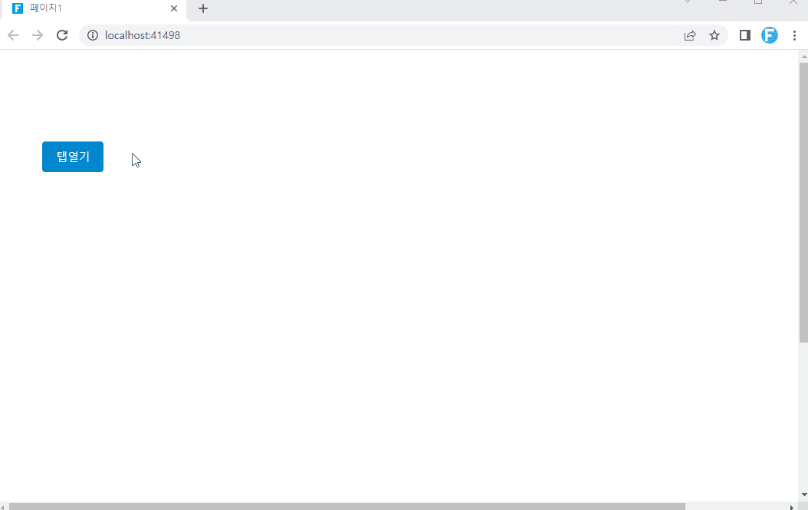

# 페이지 탭 컨트롤 (TabManager)

TabManager 플러그인을 사용하여 탭에서 내부 페이지 또는 외부 URL을 열 수 있습니다.

### 플러그인 다운로드&#x20;

버전에 맞는 플러그인을 다운로드 합니다.

<table><thead><tr><th width="234">버전 </th><th>다운로드 링크 </th></tr></thead><tbody><tr><td>V 9.0</td><td><a href="https://forguncy-korea.github.io/attached_files/Plugin_Files/V9_Plugin/TabManager.zip">TabManager.zip</a></td></tr><tr><td>v 7. 1</td><td><a href="https://forguncy-korea.github.io/attached_files/Plugin_Files/V7.1_Plugin_20211223/TabManager.zip">TabManager.zip</a></td></tr><tr><td>v 7. 0</td><td><a href="https://forguncy-korea.github.io/attached_files/Plugin_Files/V7_Plugin_20210722/TabManager.zip">TabManager.zip</a></td></tr><tr><td>v 6. 1</td><td><a href="https://forguncy-korea.github.io/attached_files/Plugin_Files/V6.1_Plugin_20201111/TabManager.zip">TabManager.zip</a></td></tr><tr><td>v 6. 0</td><td><a href="https://forguncy-korea.github.io/attached_files/Plugin_Files/V6_Plugin_20200903/TabManager.zip">TabManager.zip</a></td></tr><tr><td>v 5. 1</td><td><a href="https://forguncy-korea.github.io/attached_files/Plugin_Files/V5_Plugin_20191115/TabManager.zip">TabManager.zip</a></td></tr></tbody></table>

### 사용방법&#x20;

1. 플러그인을 다운로드합니다.
2. Forguncy Builder에서 설치하고 Forguncy Builder를 다시 실행합니다.

<figure><figcaption></figcaption></figure>

3\. 셀 영역을 선택하고, 셀 유형 "페이지 탭 컨트롤"로 설정합니다.

<figure><figcaption></figcaption></figure>

4\. 페이지 텝 열기 명령을 설정합니다.

&#x20;  페이지 탭 컨트롤(TabManager)는 명령과 함께 사용하여야 합니다.&#x20;

* 내부 페이지 선택&#x20;

&#x20;  페이지1과 같이 직접 페이지 이름을 입력합니다.

* 외부 URL 선택&#x20;

&#x20;  외부페이지의 경우 페이지의 전체 경로를 입력합니다.&#x20;

&#x20;  (예: [https://www.grapecity.co.kr/](https://www.grapecity.co.kr/))

4-1) "페이지2"라는 이름의 페이지를 추가한 후, 페이지 2에서 셀 영역에 "msg"라고 셀이름을 설정합니다.

<figure><figcaption></figcaption></figure>

4-2) \[페이지1]에서 "탭열기"라는 버튼을 생성하고, 명령 창에서 아래와 같이 명령을 설정합니다.

&#x20;  \-  명령선택 : 탭 명령 열기&#x20;

&#x20;  \-  내부 페이지 선택&#x20;

&#x20;       . 페이지 : 페이지2

&#x20;       . 출처 : GrapeCity     . 대상 셀 이름 : msg

<figure><figcaption></figcaption></figure>

5\. 실행을 하면 "탭열기"버튼을 클릭하면 페이지2가 탭에서 나오는 것을 확인할 수 있습니다. &#x20;

<figure><figcaption></figcaption></figure>
