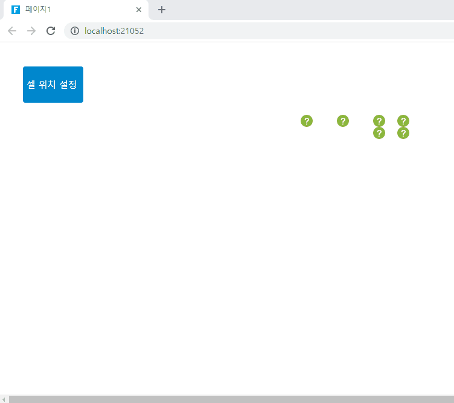

# 셀 위치 설정 명령 (SetCellLocationCommand)

셀 위치 설정 명령 플러그인은 필요에 따라 페이지에서 다양한 셀의 위치를 동적으로 이동할 수 있습니다.&#x20;

### 플러그인 다운로드&#x20;

버전에 맞는 플러그인을 다운로드 합니다.

<table><thead><tr><th width="139">버전 </th><th>다운로드 링크 </th></tr></thead><tbody><tr><td>v 9.0</td><td><a href="https://forguncy-korea.github.io/attached_files/Plugin_Files/V9_Plugin/SetCellLocationCommand.zip">SetCellLocationCommand.zip</a></td></tr><tr><td>v 7. 1</td><td><a href="https://forguncy-korea.github.io/attached_files/Plugin_Files/V7.1_Plugin_20211223/SetCellLocationCommand.zip">SetCellLocationCommand.zip</a></td></tr><tr><td>v 7. 0</td><td><a href="https://forguncy-korea.github.io/attached_files/Plugin_Files/V7_Plugin_20210722/SetCellLocationCommand.zip">SetCellLocationCommand.zip</a></td></tr></tbody></table>

### 사용방법&#x20;

명령 설정은 다음과 같습니다.&#x20;

<figure><figcaption></figcaption></figure>

| 항목    | 설명           |
| ----- | ------------ |
| 소스 셀  | 이동하는 셀       |
| 위치    | 이동해야 하는 목적지  |

### 사용 예제&#x20;

1. 이동할 셀을 페이지에 표시한다.&#x20;
2. "셀 위치 설정"버튼을 생성한다.
3. 버튼 명령 편집을 통해 셀 위치 설정 명령을 아래와 같이 설정합니다.&#x20;

<figure><figcaption></figcaption></figure>

4\. 실행을 하고, 셀 위치 설정을 클릭하면 3번에서 설정한대로 셀 위치가 변경되는 것을 확인할 수 있습니다.&#x20;

<figure><figcaption></figcaption></figure>
